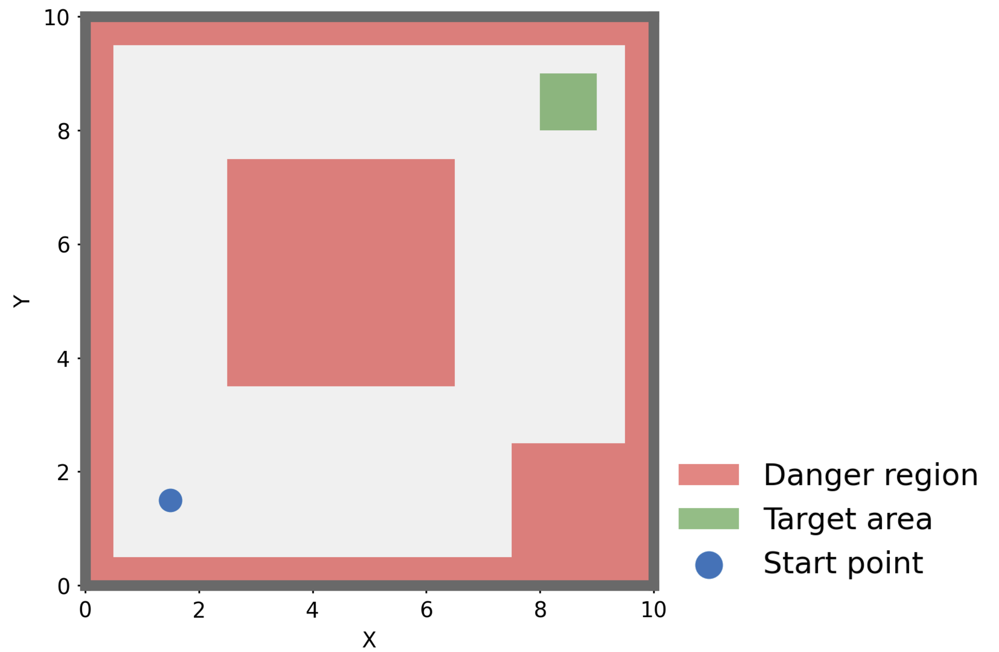

# Game-theoretic Constrained Policy Optimization (GCPO)
GCPO (Game-theoretic Constrained Policy Optimization) is a constrained reinforcement learning method. GCPO formulates the  CRL  problem as a task-constraints Markov game (TCMG), in which a task player strives to maximize the cumulative task rewards, while constraint players focus on reducing the constraint costs until the constraints are satisfied.

This repository is the implementation of GCDDPG (an off-policy version of GCPO) and typical safe reinforcement learning algorithms based on DDPG (deep deterministic policy gradient) in the SquareMapEnv.


## Requirements

The code was runned in `Python 3.11.8`.

To install other requirements:
```setup
$ pip install numpy==1.26.4
$ pip install torch==2.2.2
$ pip install matplotlib==3.8.4
$ pip install tensorboard==2.16.2
```

## Training
To train the algorithm(s), run the command
```train
$ python Run_SafeDDPG.py               
```
### Training supervision
Results can be seen with tensorboard:
```
$ cd ./results/
$ tensorboard --logdir=.
```


## Plotting Results

The Results can be visualized using the follows:

`plot_path.py`: Plot learning trajectories of algorithms.

`plot_actions.py`: Plot actions of GCPO joint policy.

`plot_hotmap.py`: Plot distributions of Q values in the map.

`plot_performance.py`: Plot learning performance of algorithms.

## SquareMapEnv


SquareMapEnv is a simulated environment designed for reinforcement learning tasks involving a mobile agent navigating a square map with hazardous regions and target zones.
The environment is intended to test and develop control algorithms for autonomous agents in a constrained and dynamic setting.

<div align="center">

</div>
**Map Layout:** The map is in a square shape with a width and height of $10$ units.

**Hazardous Regions:** There are predefined danger areas on the map that the agent should avoid.

**Target Zone:** A specific area on the map serves as the target zone that the agent needs to reach.

**State Space:** The state of the agent is represented by a tuple $(x, y, \dot{x}, \dot{y})$ where $x$ and $y$ represent the current position coordinates, $\dot{x}$ and $\dot{y}$ represent the velocity components along the $x$ and $y$ axes.
The agent starts at a defined initial state $(1.5, 1,5, 0, 0)$ within the map.

**Action Space:** The agent's actions are continuous and define the acceleration $a_t = (a^x_t, a^y_t)$ in the $x$ and $y$ directions. The agent can adjust its acceleration to control its movement.

**State Transition:** The state transition for the agent can be described using the following equations:

$$
\begin{aligned}
	x_{t+1} & = x_t + \dot{x}_t,  \\
	y_{t+1} & = y_t + \dot{y}_t, \\
	\dot{x}_{t+1} & = \dot{x}_t + a^x_t,\\
	\dot{y}_{t+1} & = \dot{y}_t + a^y_t,
\end{aligned}
$$

and the agent has a maximum speed $0 \leq v \leq 0.5$ and acceleration limit $0 \leq \text{acc} \leq 0.2$ that it must adhere to during movement, where $v =  \sqrt{ \dot{x}^2 +  \dot{y}^2 }$, and  $\text{acc}=  \sqrt{ a_x^2 +  a_y^2 }$.
The agent's movement follows basic physics principles, where acceleration influences velocity and velocity influences position. The agent's speed is limited by its maximum allowed speed, and any acceleration beyond the maximum is scaled down.

**Rewards and Costs:** The agent receives rewards $r_{\text{target}} > 0$ for reaching the target zone and incurs costs $c_{\text{safe}}> 0$  for entering danger zones. There are three initial scales of rewards and costs:

<div align="center">

|         | $r_{\text{target}}$ | $c_{\text{safe}}$ |
| :-----: | :-----------------: | :---------------: |
| Scale 1 |          1          |         1         |
| Scale 2 |         10          |         1         |
| Scale 3 |         100         |        0.1        |

</div>

which can be adjusted for evaluating the robustness of algorithms to rewards and penalties across different scales.

SquareMapEnv offers a straightforward environment for testing and training SRL/CRL algorithms in various scales of task rewards and safe costs. By utilizing the provided functions and parameters, researchers and developers can explore various methods for guiding agents to reach specified goals while avoiding hazards.
